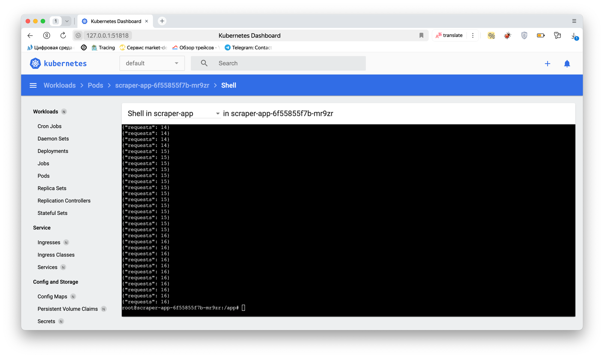

# k8s_hw

## Задание 1

Запуск:
```shell
minikube start
eval $(minikube docker-env)
./scripts/deploy.sh
```

Проверить, что все работает и получить адрес сервера:
```shell
kubectl get pods
minikube service timer-app --url
```

Чтобы проверить API можно сделать запросы к серверу по полученному IP (через прокси minikube):
```shell
curl -v http://127.0.0.1:55496/time
```

Проверить скрапер статистики можно на дашборде кубера: 


## Задание 2

Установка `istioctl`. Если у вас MacOS, запустите следующую команду: 
```shell
./scripts/setup.sh
```

Запуск `minikube`
```shell
minikube start
```

Запуск приложений:
```shell
./scripts/deploy.sh
```

